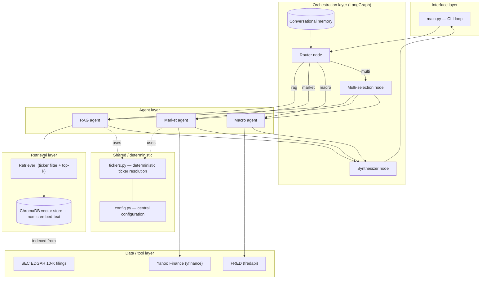
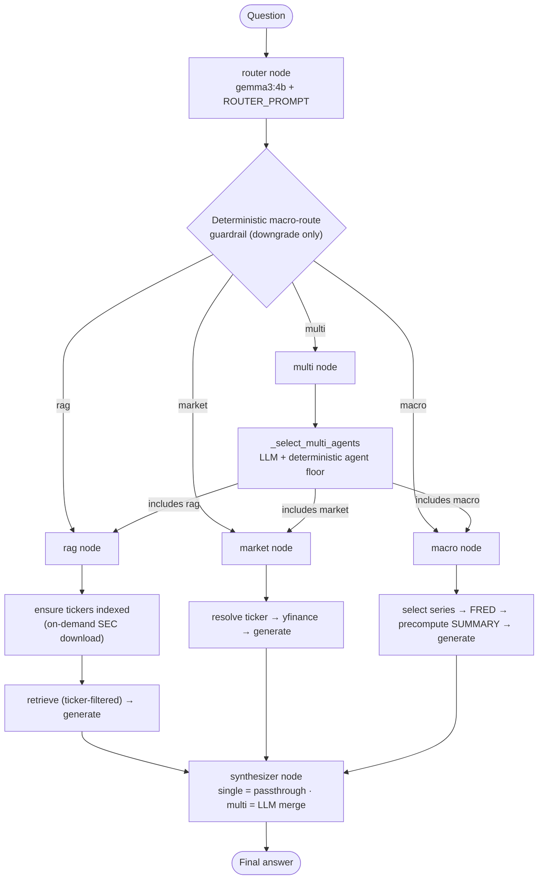
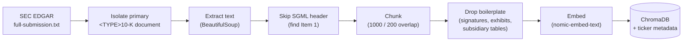

# System Architecture

**A Multi-Agent LLM Architecture for Financial Question Answering with a Local Model**
Filippo Maria Incecchi · Università degli Studi di Brescia
Analytics and Data Science for Economics and Management · Prof. Angela Locoro

---

## 1. Design philosophy

The system answers natural-language financial questions by **routing** each
question to one or more **specialized agents**, each grounded in a distinct data
source, and **synthesizing** their outputs into a single answer. Three principles
shape the design:

1. **Grounding over generation.** Every quantitative claim comes from a live tool
   (Yahoo Finance, FRED) or a retrieved SEC filing, never from the model's memory.
2. **A small, local model.** Generation runs entirely on `gemma3:4b` via Ollama —
   no cloud LLM, private and free — on commodity hardware (8 GB laptop).
3. **Deterministic guardrails around a weak model.** Because a 4B model is
   unreliable at classification, extraction and arithmetic, the fragile decisions
   are backed by deterministic code (ticker resolution, routing overrides, agent
   selection floors, macro computation), so a single weak LLM decision cannot
   cascade into a wrong answer.

---

## 2. High-level architecture

The system is organized into five layers plus a shared/deterministic module used
across them. A question enters through the CLI, is classified by the router,
dispatched to one or more agents, and the agents' outputs are merged by the
synthesizer.

---

## 3. Runtime request flow (LangGraph state machine)

The orchestrator is a **LangGraph** `StateGraph`. All nodes read from and write to
a shared `AgentState` (question, history, route, the three agent answers, final
answer).

**Graph definition:** entry point `router`; conditional edges from `router` to
`{rag, market, macro, multi}`; the `multi` node internally runs the selected
subset of the three agents; every agent path and the `multi` path lead to
`synthesizer`; `synthesizer → END`.

---

## 4. Component reference

| Module | Responsibility | Key technology |
|---|---|---|
| `main.py` | CLI entry point; ingestion bootstrap; interactive loop; `clear` command | — |
| `agents/orchestrator.py` | LangGraph graph; router; multi-selection; synthesizer; on-demand ingestion; `run` / `run_traced` | LangGraph, ChatOllama |
| `memory.py` | `ConversationMemory`: bounded last-N turns, rendered into prompts | — |
| `tickers.py` | Deterministic ticker resolution (`scan_known_tickers`) + defensive LLM parse (`parse_llm_tickers`) | regex, `COMPANY_ALIASES` |
| `config.py` | Central configuration (model, paths, chunking, macro window, company map) | — |
| `agents/rag_agent.py` | Retrieve → augment → generate over SEC filings; strict context-only prompt | ChatOllama |
| `agents/market_agent.py` | Ticker → Yahoo Finance quote/metrics → grounded answer | yfinance, ChatOllama |
| `agents/macro_agent.py` | Series selection → FRED fetch → precomputed SUMMARY → grounded answer | fredapi, pandas, ChatOllama |
| `rag/retriever.py` | Ticker-filtered top-k retrieval; graceful unfiltered fallback | — |
| `rag/vectorstore.py` | ChromaDB persistence; embeddings via Ollama `nomic-embed-text` | ChromaDB, Ollama |
| `rag/ingestor.py` | Download → extract primary 10-K → drop boilerplate → chunk → embed → index | sec-edgar-downloader, BeautifulSoup, LangChain splitter |

---

## 5. The router and the deterministic guardrails

The router is a single `gemma3:4b` call classifying the question into
`rag | market | macro | multi`. Because a 4B model mis-classifies edge cases, two
deterministic mechanisms wrap it:

- **STEP-0 prompt rule**: a macro topic combined with a company or a stock/market
  term is always `multi` (prevents macro+company leaking to a single agent).
- **`_guard_macro_route` (code)**: if the LLM says `multi` but the question has a
  macro term and **no company and no market term**, it is downgraded to `macro`
  (fixes pure-macro questions phrased as comparisons).

For the `multi` route, `_select_multi_agents` (an LLM call) chooses which agents
to combine, then a **deterministic floor** re-adds the market or macro agent
whenever the question carries their cue terms — so a needed agent is never
dropped (this eliminated the cascading "invented figure" failures).

---

## 6. The three agents

### 6.1 RAG agent (SEC 10-K filings)
1. **Ticker resolution** (deterministic-first, via `tickers.py`): scan the
   question against `COMPANY_ALIASES`; only fall back to the LLM for unknown
   companies or pronoun follow-ups.
2. **On-demand indexing**: if a resolved ticker is not indexed, download and
   index its 10-K from SEC EDGAR at query time.
3. **Ticker-filtered retrieval**: ChromaDB metadata filter restricts the search
   to the correct company; top-k chunks are retrieved (`nomic-embed-text`).
4. **Grounded generation**: a strict prompt forces the model to answer only from
   the retrieved context and to admit when the context is insufficient.

### 6.2 Market agent (Yahoo Finance)
Resolves the ticker (deterministic-first), fetches price, returns, market cap,
P/E, dividend, 52-week range and volume via `yfinance`, formats them into a data
block (NaN-safe), and generates a grounded answer restricted to those figures.

### 6.3 Macro agent (FRED)
Selects the relevant FRED series (GDP, CPI→inflation, Fed funds, unemployment),
fetches a fixed history window (24 months / 8 quarters), and **computes the
headline facts in code** — latest value, period-over-period change,
year-over-year change and trend direction — as a `SUMMARY` block the model quotes
verbatim, removing the date-attribution and arithmetic the 4B model gets wrong.

---

## 7. Synthesizer and memory

- **Synthesizer**: for a single active agent it passes the answer through; for a
  multi-agent question it merges the agents' outputs into one concise, grounded
  response, preserving "not available" signals and not recomputing figures.
- **Conversational memory** (`ConversationMemory`): stores the last N turns and is
  injected into the router, the ticker/series extractors and the synthesizer so
  follow-ups such as "and its stock price?" resolve to the right entity.

---

## 8. Offline ingestion pipeline

Isolating the primary 10-K document discards ~95–98 % of the raw submission
(exhibits and inline XBRL), so the whole narrative fits the character budget and
the index holds disclosure rather than noise.

---

## 9. Deterministic guardrails (cross-cutting theme)

| Guardrail | LLM weakness it compensates for | Location |
|---|---|---|
| Deterministic ticker scan | small model emits filler ("Okay") or wrong ticker | `tickers.py` |
| STEP-0 router rule + `_guard_macro_route` | macro questions mis-routed to a single agent | `orchestrator.py` |
| Multi-agent selection floor | needed market/macro agent dropped → invented data | `orchestrator.py` |
| Precomputed macro `SUMMARY` | date mis-attribution, fabricated values, wrong trend | `macro_agent.py` |
| Strict context-only RAG prompt | hallucination when retrieval is thin | `rag_agent.py` |
| NaN-safe market formatting | `nan%` returns rendered as figures | `market_agent.py` |

---

## 10. Technology stack

| Concern | Technology |
|---|---|
| Generation LLM | `gemma3:4b` via **Ollama** (local) |
| Orchestration | **LangGraph** state machine |
| Vector store | **ChromaDB** (persistent, cosine) |
| Embeddings | **nomic-embed-text** (768-dim) via Ollama |
| Company filings | **SEC EDGAR** 10-K (`sec-edgar-downloader`) |
| Market data | **Yahoo Finance** (`yfinance`) |
| Macro data | **FRED** (`fredapi`) |
| Filing parsing | **BeautifulSoup**, LangChain `RecursiveCharacterTextSplitter` |
| Evaluation | **RAGAS** library, judge = **Claude Haiku 4.5** (API); local LLM-as-judge for the rubric run |

---

## 11. Evaluation harness (summary)

A separate `evaluation/` package holds the 100-question benchmark
(`questions.py`), the multi-turn dialogues (`dialogues.py`) and a single harness
(`phase3_ragas_eval.py`) with modes: `--collect` (run the system and save traces),
`--score` (RAGAS library scoring), `--baseline` (bare-model ablation) and
`--multiturn` (conversational-memory ablation). Full results are in
`evaluation/results/`. See the thesis outline for how each result maps to the
Evaluation and Results chapters.
